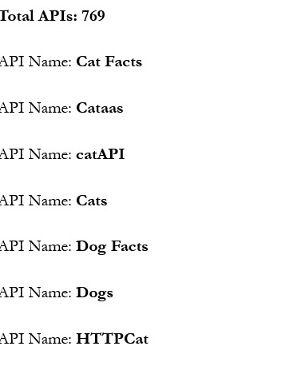

# Wordpress API Call with PHP
 Calling a GET-API with Wordpress with the use of a PHP to Shortcode Plugin

# Steps and Requirements

1. Download the "Insert PHP Code Snippet"-Plugin and install and activate it
2. Copy and paste the code of the PHP-file in the repo
3. Use the shortcode on any post or page

# Disclaimer
In this tutorial file I use a public API

# Result
I filtered the response to get only the count object and all the API names which will be printed in a loop.

The result looks like this:

